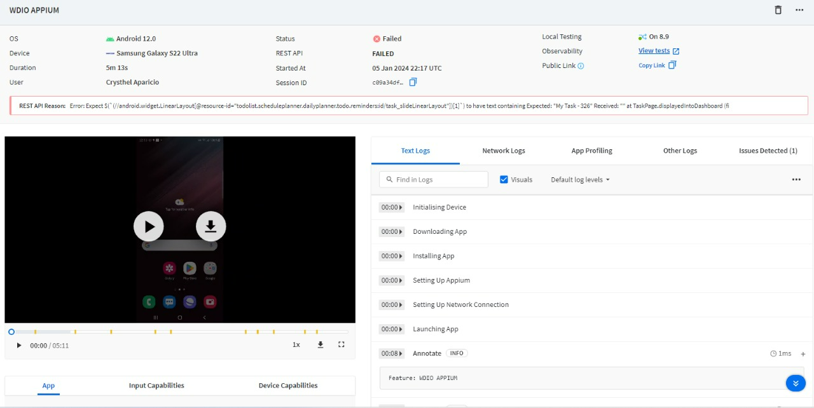

# WDIOAppiumProject


## Description
The project aims to automate the testing of a mobile application using WebdriverIO and Appium. 
The mobile application is a to-do list app that enables users to manage their daily tasks, set reminders, and categorize tasks.

### Prerequisitos
node.js version 16 or higher is required
* android studio ,SDK, virtual machine emulator
* intellij IDEA Conmunity -https://www.jetbrains.com/es-es/idea/download/#section%3Dwindows
* JDK 11
* install node.js here [node.js](https://nodejs.org/en/)
* Install Appium (https://appium.io/docs/en/2.0/)
* Install WebdriverIO (https://webdriver.io/docs/gettingstarted/)
* Install (https://mvnrepository.com/artifact/junit/junit/3.8.1) 
* Install (JAVA https://mvnrepository.com/artifact/io.appium/java-client/6.0.0)
* Install Cucumber (https://mvnrepository.com/artifact/io.cucumber/cucumber-java/1.2.5)
                    (https://mvnrepository.com/artifact/io.cucumber/cucumber-picocontainer/1.2.5)
                    (https://mvnrepository.com/artifact/info.cukes/cucumber-junit/1.2.5)


## Structure
```
└───WDIOAPPIUMPROJECT/
   ├   ├───api/
   ├     └───To-Do-List-SchedulePlanner.apk/
   │   └───features/
   │      └───pageobjects/   
   │      └───steps-definitions/
   │         └───steps/
   │      └───login.feature/ 
   │       └───Pending-task.feature/ 
          └───popups.feature/ 

```
api/ This is where we have the application to install
**steps/**contain the logic developed for the automation
resources/featurres contains the steps that the .feature file use.
login.feature is a feature definition file used in behavior-based software development methodology

## Installation
Once the repository is cloned, in the command line paste the following command: 
```
- npm install
- npm init wdio@latest (https://webdriver.io/docs/gettingstarted/)
-  npm install --save-dev @wdio/browserstack-service

```
## Usage
### Open Tests visually
```
1. Execute wdioappium, 

- Command to execute one feature at a time
 ```sh
   npm run wdio:login
   npm run wdio:pending
   npm run wdio:popups
 ```----------------
 run with browserstack 

   npm run wdio-bs:login
   npm run wdio-bs:pending
   npm run wdio-bs:popups
```
### Browserstack integracion Live + WebdriverIO




## Description 
In this link you can see the video of the integration with browserstack :

https://app-automate.browserstack.com/builds/b60e1e5e778e4592606313743caad700d3ac044c/sessions/c09a34dfe9b8691eaf3d98337db8341e03c0d090?auth_token=8ffe2f6f3ac2598246344a935d28e15f5fde9628ecaa575eec0664e64c93dc09 


https://app-automate.browserstack.com/builds/aa61fc49802afe377be315d57cc5296ec8c51883/sessions/f63d111fcd23ea3daefb23285a47ecd633191f35?auth_token=e7af1efe0f4096d614d585cf87c025596e98cf89e0a97ab2339d8b11ad1d8fd8

## Software needed
- [Visual Studio Code](https://code.visualstudio.com/).
- [NodeJS](https://nodejs.org/en/)

 

#

## License
For the Volaris company only.   


